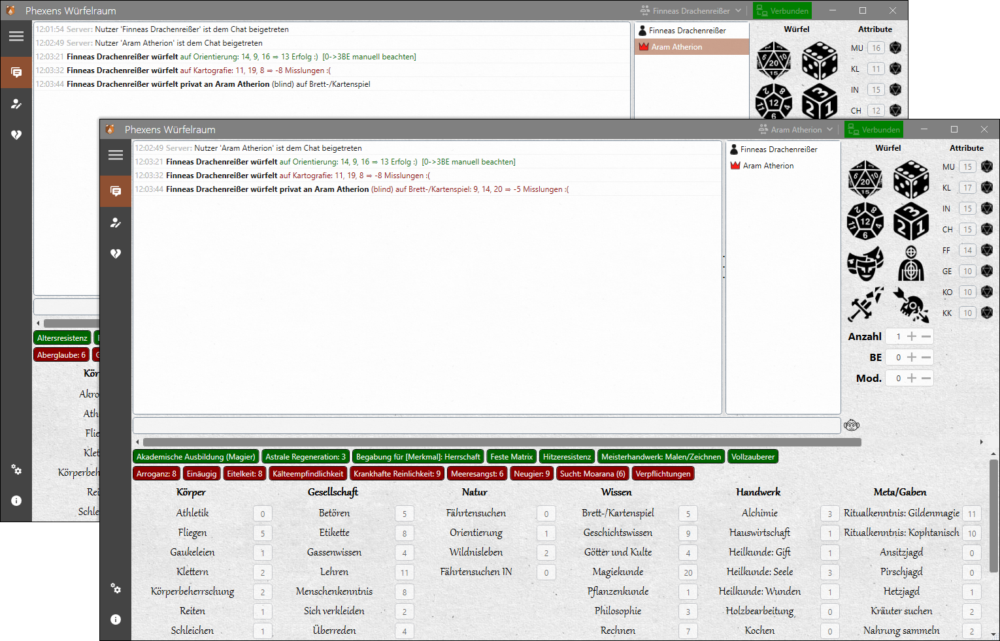

[](https://github.com/markuskonojacki/PhexensWuerfelraum/blob/master/LICENSE)
[](https://github.com/markuskonojacki/PhexensWuerfelraum/graphs/contributors)


| [DE](#phexens-würfelraum)
|:---|
| [EN](#phexs-dice-room)




| DE |
|:---|

# Phexens Würfelraum
Zuvorderst: Phexens Würfelraum ist ein komplett __NICHT__ offizielles Projekt meinerseits. Es besteht keinerlei offizielle Verbindung zu Fanpro, Ulisses Spiele, der Significant Fantasy Medienrechte GbR oder ihren Produkten.

Nun zum Tool selbst: Phexens Würfelraum ist ein Programm um es Menschen zu ermöglichen, gemeinsam [Das Schwarze Auge](http://www.ulisses-spiele.de/sortiment/rollenspiele/das-schwarze-auge/) über das Internet zu spielen. Es unterstützt den Import von durch die [Helden-Software](https://www.helden-software.de/) erstellten Charakteren.

## Client

### Installation

Klickt auf [Releases](https://github.com/markuskonojacki/PhexensWuerfelraum/releases/latest), ladet euch die `PhexensWuerfelraum-v*.*.*.zip` des aktuellen Releases herunter, entpackt die Datei `PhexensWuerfelraum.exe` und startet sie. Phexens Würfelraum installiert sich von selbst und erstellt Verknüpfungen auf Desktop sowie im Startmenü.

### Daten
Alle Daten werden unter `%LocalAppData%/PhexensWuerfelraum` gespeichert.

## Server

### Allgemein

- Ladet euch aus den [Releases](https://github.com/markuskonojacki/PhexensWuerfelraum/releases/latest) die für eurer Betriebssystem passende `Server-*.zip` herunter und entpackt diese
- Geht in den Unterordner `config` und benennt die Datei `settings.example.ini` in `settings.ini` um
- Passt die Variablen in der `settings.ini` entsprechend eurer Anforderungen an

### Linux

Das Ausführen des Server setzt das Mono Framework voraus. Die sicherste Methode um alle Abhängigkeiten zu installieren wäre:
```bash
apt install mono-complete
```

Mache die Applikation ausführbar.
```bash
chmod +x PhexensWuerfelraum.Server.Console
```

Starte die Applikation. Die Angabe des Portes kann wahlweise über die `settings.ini` oder einen Übergabeparameter erfolgen. Der Übergabeparameter hat Vorrang.
```bash
./PhexensWuerfelraum.Server.Console --port 12113
```

### Windows

Starte die Applikation. Die Angabe des Portes kann wahlweise über die `settings.ini` oder einen Übergabeparameter erfolgen. Der Übergabeparameter hat Vorrang.
```bash
C:\VSDistribution\PhexensWuerfelraum.Server.Console\PhexensWuerfelraum.Server.Console.exe --port 12113
```

## Lizenz

Phexens Würfelraum ist unter der MIT Lizenz veröffentlicht. 
Für Details siehe: [LICENSE.txt](LICENSE.txt)
Lizenzen von Dritt-Hersteller-Software, Grafiken und Soundeffekten finden sich hier: [THIRD-PARTY-LICENSES.txt](THIRD-PARTY-LICENSES.txt)

DAS SCHWARZE AUGE, AVENTURIEN, DERE, MYRANOR, THARUN, UTHURIA und RIESLAND sind eingetragene Marken der Significant Fantasy Medienrechte GbR.

| EN |
|:---|

# Phex's Dice Room
Phex's Dice Room is an application to support online play of the pen and paper game [The Dark Eye](https://www.ulisses-us.com/games/the-dark-eye/).
I currently do not have plans to support other languages apart from german.

## License
Phex's Dice Room is licensed under the MIT license.
For details see: [LICENSE.txt](LICENSE.txt)
For licenses of third partys see: [THIRD-PARTY-LICENSES.txt](THIRD-PARTY-LICENSES.txt)
